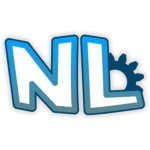

# Native Legacy



a backwards compatibility layer for Roblox that allows people to play their old favourite games again!

---

## What?

Native Legacy restores dated engine behaivour on the modern Roblox client, by modifying scripts and creating a sandbox.

Examples of things NL does:

- Loads a giant library of uncopylocked & archived games.
- Grants access to some VIP rooms and admin features through Badge/Friend spoofing. 
- Restores `Flag`/`FlagStand` functionality.
- Fixes HopperBins, and restores server-sided mouse access.
- Emulates the Sets API.
- Redirects `InsertService` calls to `AssetService`.
- Provides a pseudo version of `BadgeService`.
- Restores popular linked sources to fix Brickbattle tools.

## What Makes it Work?

The scripts inside of games/models have an injector appended to the top of them. Example below.

Before:

```lua
local MOUSE_ICON = 'rbxasset://textures/GunCursor.png'
local RELOADING_ICON = 'rbxasset://textures/GunWaitCursor.png'
```

After: 

```lua
require(game:WaitForChild("native_legacy"))(getfenv());local MOUSE_ICON = __STRDEC 'rbxasset://textures/GunCursor.png'
local RELOADING_ICON = __STRDEC 'rbxasset://textures/GunWaitCursor.png'
```

The loader underneath game forces the environment into the sandbox, allowing Native Legacy to alter the script's behaviour through **patches**.

If you've ever played Script Builder games, they generally function similarly - accept our primary case is for compatibility rather than restrictions.

## Licensing & Contributions

Native Legacy is currently provided in a **source public** state - this means *all rights are reserved* and the project is not technically open source. This will change once we reach our MVP - please stay tuned!

## Attribution

[Classic Build Tools](https://create.roblox.com/store/asset/1148735607/Classic-Build-Tools) by MaximumADHD - A modified version of this model is used. The NL version uses Accessories in-place of tools.